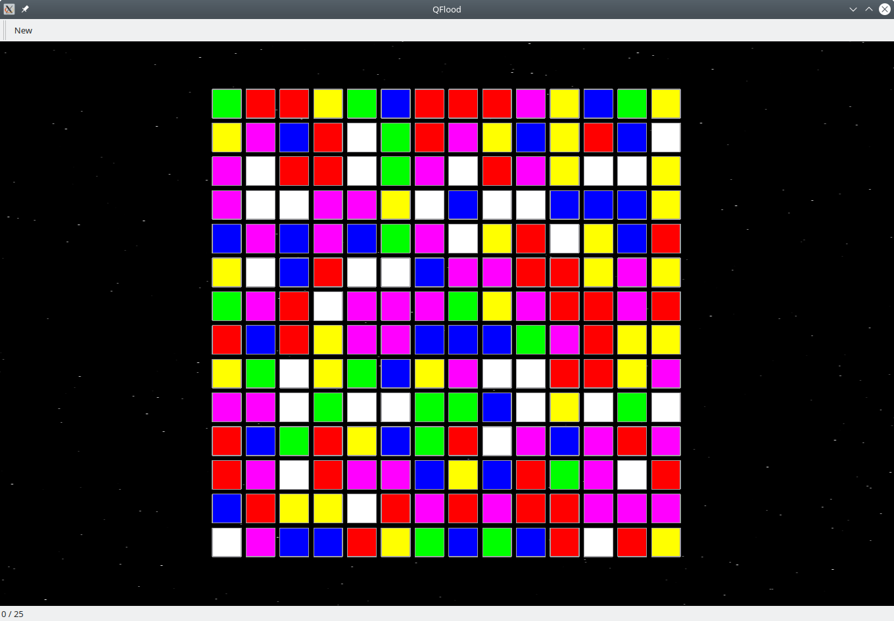

# QFlood
Just another flood it clone... with parallax starfield background.



## Build
```
mkdir build
cd build
cmake ../ -DCMAKE_BUILD_TYPE=Release
make
```
## Credits
- click.wav by [kwahmah_02](https://freesound.org/people/kwahmah_02) from [freesound.org](https://freesound.org)
- fshader.glsl: Modified version of [Parallax starfield](https://www.shadertoy.com/view/WsfGDM) by [dax105](https://www.shadertoy.com/user/dax105)

## License
- fshader.glsl: [CC BY-NC-SA 3.0](https://creativecommons.org/licenses/by-nc-sa/3.0/)
- All other: [MIT License](./LICENSE.md)
